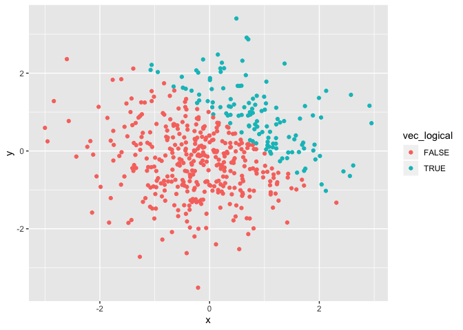
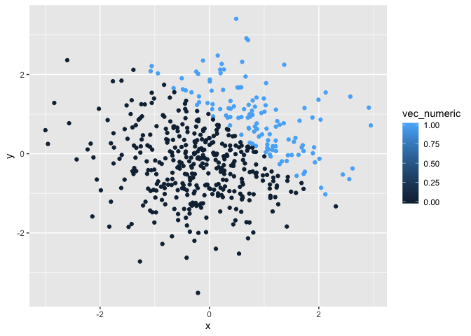
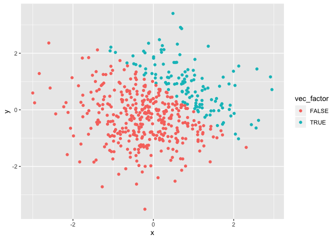

p8105\_hw1\_sm4594
================
Sophia Miller
9/15/2019

# Problem 1.

Create a data frame comprised of:

  - a random sample of size 8 from a standard Normal distribution
  - a logical vector indicating whether elements of the sample are
    greater than 0
  - a character vector of length 8
  - a factor vector of length 8, with 3 different factor “levels”

<!-- end list -->

``` r
problem1_df = tibble(
  norm_samp = rnorm(8),
  norm_samp_pos = norm_samp > 0,
  vec_char = c("This", "is", "the", "first", "data", "science", "homework", "assignment"),
  vec_factor = factor(c("one", "two", "three", "one", "two", "three", "one", "two"))
)
```

Take the mean of each variable in the data frame
    above:

``` r
  mean(pull(problem1_df, norm_samp))
```

    ## [1] 0.1498929

``` r
  mean(pull(problem1_df, norm_samp_pos))
```

    ## [1] 0.375

``` r
  mean(pull(problem1_df, vec_char))
```

    ## Warning in mean.default(pull(problem1_df, vec_char)): argument is not
    ## numeric or logical: returning NA

    ## [1] NA

``` r
  mean(pull(problem1_df, vec_factor))
```

    ## Warning in mean.default(pull(problem1_df, vec_factor)): argument is not
    ## numeric or logical: returning NA

    ## [1] NA

We are able to take the mean of the random sample as well as the logical
vector, but we are unable to take the mean of the character and factor
vectors.

Convert logical, character, and factor variables to numeric:

``` r
  as.numeric(pull(problem1_df, norm_samp_pos)) 

  as.numeric(pull(problem1_df, vec_char))
```

    ## Warning: NAs introduced by coercion

``` r
  as.numeric(pull(problem1_df, vec_factor))
```

  - convert the logical vector to numeric, and multiply the random
    sample by the result

  - convert the logical vector to a factor, and multiply the random
    sample by the result

  - convert the logical vector to a factor and then convert the result
    to numeric, and multiply the random sample by the result Problem 2

<!-- end list -->

``` r
  as.numeric(
    pull(problem1_df, norm_samp_pos))*(pull(problem1_df,  norm_samp))
```

    ## [1] 1.9607541 0.5939421 0.0000000 1.2279908 0.0000000 0.0000000 0.0000000
    ## [8] 0.0000000

``` r
  as.factor(
    pull(problem1_df, norm_samp_pos))*(pull(problem1_df,  norm_samp))
```

    ## Warning in Ops.factor(as.factor(pull(problem1_df, norm_samp_pos)),
    ## (pull(problem1_df, : '*' not meaningful for factors

    ## [1] NA NA NA NA NA NA NA NA

``` r
  as.numeric(
    as.factor(
      pull(problem1_df, norm_samp_pos)))*(pull(problem1_df,  norm_samp))
```

    ## [1]  3.92150812  1.18788423 -0.79458195  2.45598156 -1.00414031 -0.10202350
    ## [7] -0.07641574 -0.60638225

\#Problem 2

Create a data frame comprised of:

  - x: a random sample of size 500 from a standard Normal distribution
  - y: a random sample of size 500 from a standard Normal distribution
  - a logical vector indicating whether x + y \> 1
  - a numeric vector created by coercing the above logical vector
  - a factor vector created by coercing the above logical vector

<!-- end list -->

``` r
problem2_df = tibble(
  x = rnorm(500),
  y = rnorm(500),
  vec_logical = x + y > 1,
  vec_numeric = as.numeric(vec_logical),
  vec_factor = as.factor(vec_logical)
)
```

Make a scatterplot of y vs. x; color points using logical
variable:

``` r
ggplot(problem2_df, aes(x = x, y = y, color = vec_logical)) + geom_point()
```

<!-- -->

Make a scatterplot of y vs. x; color points using numeric
variable:

``` r
ggplot(problem2_df, aes(x = x, y = y, color = vec_numeric )) + geom_point()
```

<!-- -->

Make third scatterplot of y vs. x; color points using factor
variable:

``` r
ggplot(problem2_df, aes(x = x, y = y, color = vec_factor )) + geom_point()
```

<!-- -->
